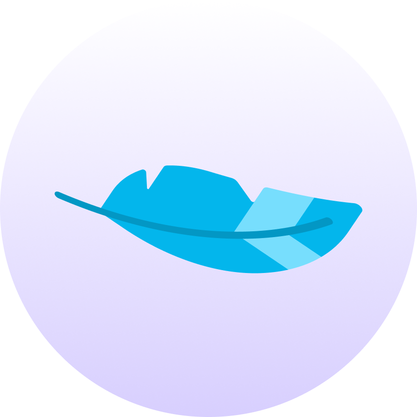
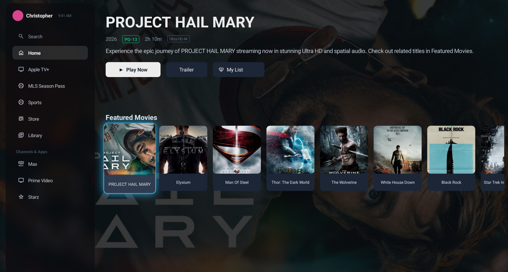

#  FeatherUI

FeatherUI is a **high-performance, ultra-lightweight rendering engine and UI framework** for Android, written from the ground up to mimic Chromium and Skia’s compositing architecture. Designed specifically for memory-constrained environments (like Android TV and legacy devices), FeatherUI runs on a high-speed, main-thread-independent rendering pipeline that delivers 60 FPS visual smoothness with a microscopic memory footprint.

---

## Demo Preview

Here is a preview of the Apple TV / Android TV launcher dashboard built completely on FeatherUI, showcasing backdrop blurs, item grid/list recycling, and focus animations:



---

## The Motivation

Traditional Android layouts (nested `ConstraintLayout`s, heavy `WebView` instances, or complex Jetpack Compose hierarchies) come with massive overhead:
1. **High Memory Overhead:** Creating hundreds of native Android `View` objects creates significant garbage collection (GC) churn and consumes heavy RAM.
2. **Main Thread Blocking:** Measuring and laying out complex hierarchies on the main thread causes UI stuttering (jank) and frames dropping.
3. **Pastel/Banding Blurs:** Standard background blurs on legacy devices are often slow, memory-intensive, and produce low-bitrate washed-out banding.

### How FeatherUI Solves This:
* **Virtual DOM / Virtual Nodes:** The entire layout is represented as a lightweight tree of pure Java objects (`VirtualNode`), bypassing the heavy Android View system.
* **Single SurfaceView Pipeline:** FeatherUI draws the entire virtual tree onto a single hardware-accelerated 32-bit `SurfaceView` from a dedicated asynchronous render thread.
* **Microscopic RAM Footprint:** Typical heap usage stays under **15MB**, making it ideal for low-end Android TV boxes and embedded Android devices.
* **Zero-Allocation Paint Loops:** Custom object pools cache vectors, rectangles, paints, and shaders, ensuring absolutely **zero garbage collection activity** during high-frequency UI updates and scrolling.

---

## Key Specifications & Performance Benchmarks

| Metric | Traditional Android Native / Compose | FeatherUI Rendering Engine |
| :--- | :--- | :--- |
| **Heap Memory Usage** | ~80MB – 150MB | **< 15MB** |
| **Frame Render Time** | 8ms – 16ms (often variable) | **< 4.0ms** (highly consistent) |
| **Garbage Collector Churn** | Continuous allocations on scroll | **0 allocations** (completely static loop) |
| **Blur Performance (CPU)** | CPU-bound bottlenecks (80+ms) | **~3ms** (Separable Bilinear Box Blur) |
| **Color Precision** | Default RGB_565 (creates banding) | **RGBA_8888** (true 32-bit blending) |

---

## Technical Details & Architecture

### 1. The Rendering Pipeline
FeatherUI operates like Chromium's renderer:
* **Measure & Layout Passes:** Initiated on the root node and propagated down the tree. Layout coordinates are kept relative to parents until drawing, preventing tree-wide updates when translating.
* **Occlusion Culling:** Skips drawing nodes that are entirely outside the device viewport bounds plus a scaling pad. This eliminates useless pixel ops during rapid list scrolling.
* **32-Bit RGBA Precision:** Window and SurfaceView formats are explicitly locked to `RGBA_8888` to prevent intermediate 16-bit color quantization and gradient banding.

### 2. High-Performance Backdrop Blur (Glassmorphism)
FeatherUI implements a highly-optimized, downsampled blur strategy inspired by Blink's backdrop filter:
* **Downsampling Crop:** Sub-regions are cropped from the backdrop source and downsampled **4x** before blurring, reducing pixel operations by **93.75%**.
* **Premultiplied Alpha Convolution:** Pixels are converted from straight-alpha to premultiplied-alpha prior to running the 3-pass horizontal/vertical separable box blur convolution. This eliminates the pastel/gray edge halos typical of legacy blurs.
* **Clipped Overlay Masking:** The blurred buffer is scaled back up and masked using custom rounded-rect clipping paths, rendering as a gorgeous frosted-glass effect.

### 3. Vsync-Aware Animation Engine
* Synchronized with the Android display refresh rate using the hardware `Choreographer` clock timebase.
* Monotonic nano-timestamping (`System.nanoTime() / 1,000,000L`) eliminates clock misalignment bugs and temporal stutter.
* Supports custom easings (e.g., `"ease_out"` focus zoom scaling).

---

## Usage Example

### 1. Define the Layout (JSON)
FeatherUI layouts are declared using high-performance JSON layout templates. Here is a simple card layout (`item_show_card.json`):

```json
{
  "type": "button",
  "width": 140,
  "height": 190,
  "background_color": "#1E293B",
  "border_radius": 10,
  "focused_background_color": "#334155",
  "focused_border_color": "#38BDF8",
  "focused_border_width": 2,
  "focused_glow_color": "#38BDF8",
  "focused_glow_radius": 20,
  "children": [
    {
      "type": "linear_layout",
      "orientation": "vertical",
      "width": "match_parent",
      "height": "match_parent",
      "children": [
        {
          "id": "card_image",
          "type": "image_view",
          "width": "match_parent",
          "height": 140,
          "scale_type": "center_crop",
          "border_radius": 10
        },
        {
          "id": "card_title",
          "type": "text_view",
          "width": "match_parent",
          "height": 50,
          "text_size": 12,
          "text_color": "#E2E8F0",
          "gravity": "center",
          "padding": 4
        }
      ]
    }
  ]
}
```

### 2. Inflate and Display (Java)
To host FeatherUI inside your app, place `FeatherUIView` in your XML layout and load the virtual layout tree:

```java
public class MainActivity extends AppCompatActivity {
    private FeatherUIView featherUIView;
    private UILayout uiLayout;

    @Override
    protected void onCreate(Bundle savedInstanceState) {
        super.onCreate(savedInstanceState);
        getWindow().setFormat(android.graphics.PixelFormat.RGBA_8888); // 32-bit screen depth
        setContentView(R.layout.activity_main);

        featherUIView = findViewById(R.id.feather_ui_view);

        // Load JSON layout string from assets
        String layoutJsonStr = loadJSONFromAsset("tv_show_layout.json");

        // Inflate the Virtual Node tree
        uiLayout = JSONLayoutInflater.inflate(this, layoutJsonStr, featherUIView);
        featherUIView.setLayout(uiLayout);

        // Update properties dynamically
        uiLayout.updateProperty("show_title", "text", "PROJECT HAIL MARY");
        uiLayout.updateProperty("backdrop", "src", "https://image.tmdb.org/t/p/w1280/poster.jpg");
    }
}
```

---

## Project Structure

This repository is split into two modules:
* **`:app` (Demo Application):** A complete showcase of an Android TV leanback interface. It imports metadata from `movies.json`, initializes horizontal recycled list nodes (`ListViewNode`), connects remote control/keyboard events, and triggers focus state transition animations.
* **`:featherui` (Engine Library):** The core framework housing the custom layouts, virtual nodes, animation sequencer, image loaders, focus managers, and the SurfaceView rendering thread.

---

## How to Contribute

Contributions to FeatherUI are highly welcome! To ensure performance integrity:
1. **No Allocations in Draw:** Avoid creating objects (like `new Paint()`, `new RectF()`, or arrays) inside `onDraw()` or methods called during rendering. Use the static `ObjectPool` to acquire and release structures.
2. **Thread Safety:** Ensure all focus animations or structural changes to the layout tree are queued and applied via the `MainLooper` to prevent race conditions with the asynchronous render thread.
3. **Format Validation:** Always compile and check your code with `.\gradlew compileDebugJavaWithJavac` before submitting pull requests.

---

## License

FeatherUI is licensed under the **FeatherUI Source-Available License**. 

* **For Application Developers:** You are free to use the compiled library (AAR/JAR) for any application (commercial or personal) free of charge, with attribution.
* **For Contributors:** You are permitted to clone, compile, and run the source code for testing and contributing back to this project.
* **Restrictions:** You may **not** copy, modify, or recompile the raw source code of this library/engine for use in another organization's proprietary rendering codebase, nor distribute recompiled binaries under a different name.

Please see the [LICENSE](LICENSE) file for the full text.
